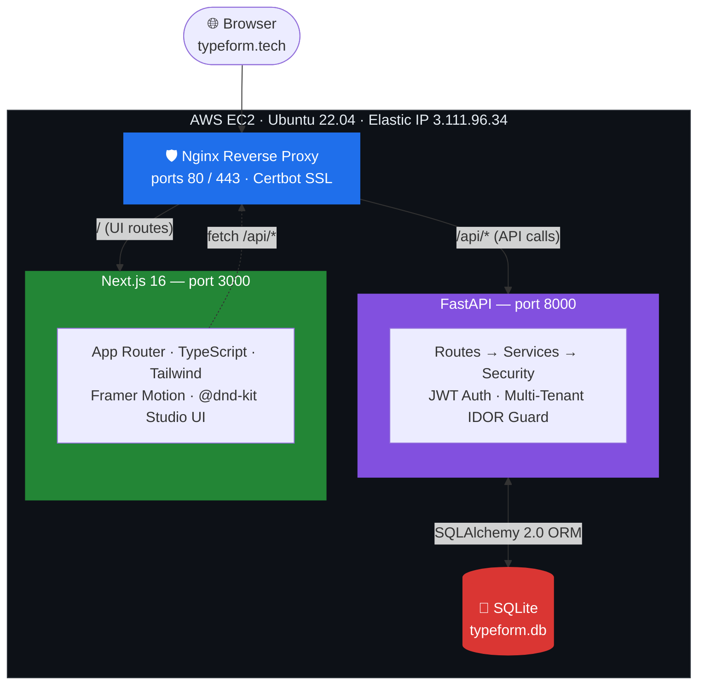
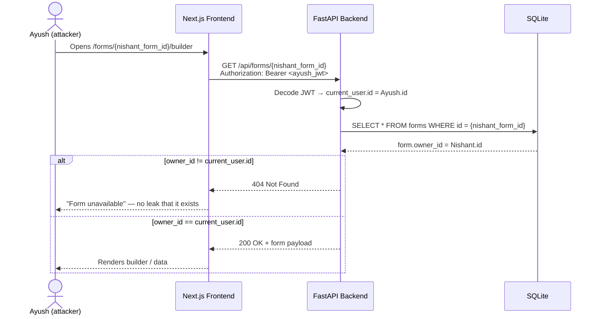
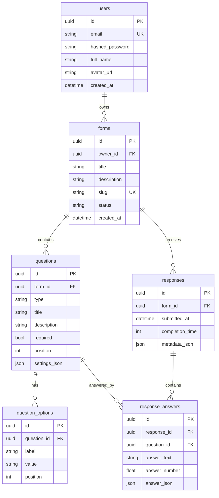

# Typeform Clone — Conversational Forms, Rebuilt from Scratch

A full-stack, multi-tenant form builder and survey platform inspired by Typeform — the drag-and-drop builder, the one-question-at-a-time respondent flow, the smooth micro-animations, all of it, built end-to-end on a FastAPI + Next.js stack with real IDOR-hardened multi-tenancy instead of the usual toy auth you see in clone projects.

It's not just "forms in a database." Every form, question, and response is scoped to an owner, every creator-only route re-verifies ownership server-side, and unauthorized access fails closed with a 404 instead of leaking whether a resource even exists.

**Live app:** [typeform.tech](https://typeform.tech) · [www.typeform.tech](https://www.typeform.tech)

---

## Table of Contents

- [Why This Project Exists](#why-this-project-exists)
- [Try It Out](#try-it-out)
- [Core Features](#core-features)
- [Architecture](#architecture)
- [Multi-Tenant Security Model](#multi-tenant-security-model)
- [Database Schema](#database-schema)
- [Tech Stack](#tech-stack)
- [API Reference](#api-reference)
- [Testing](#testing)
- [Running It Locally](#running-it-locally)
- [Production Deployment](#production-deployment)
- [What I'd Build Next](#what-id-build-next)

---

## Why This Project Exists

Most "Typeform clone" projects on GitHub stop at getting the animations right and call it done. This one goes further — it's built as a genuine multi-tenant SaaS, meaning two completely different creators can use the same instance, build their own forms, and never see a byte of each other's data, even if they guess each other's form IDs. That constraint shaped almost every backend decision here: ownership checks aren't a middleware afterthought, they're baked into every single query.

The goal was to end up with something that reads like a real product's codebase — not a tutorial project — while still nailing the part that made Typeform famous in the first place: a form that feels like a conversation, not a spreadsheet.

## Try It Out

The database ships pre-seeded with two separate creator accounts so you can see the tenant isolation for yourself — log in as one, then the other, and notice neither can see the other's forms.

| User | Email | Password | Seeded Forms |
|---|---|---|---|
| **Nishant** | `nishant@example.com` | `password123` | Customer Feedback Form (published, 3 responses) · Employee Experience Survey (draft) |
| **Ayush** | `ayush@example.com` | `password123` | Product Survey (published, 2 responses) · Event Feedback (published) |

You can also skip the demo accounts entirely and sign in with **"Continue with Google"** on `/login` — it's wired up to real Google OAuth 2.0, not a mock.

## Core Features

**Multi-tenant isolation & IDOR protection**
- Every form carries an `owner_id` foreign key back to `users.id` — there's no such thing as an ownerless or shared-by-default form.
- The dashboard's `/forms` query is filtered strictly to `current_user.id`; nothing else is ever returned, not even for debugging convenience.
- Every creator-facing route — builder, responses, statistics, question CRUD, publish/unpublish, duplicate, delete — re-checks ownership server-side and returns a plain `404` on mismatch, so an attacker probing IDs can't even confirm a form exists.

**Interactive builder studio** (`/forms/[id]/builder`)
- Three-column layout: question outline on the left, live canvas in the center, contextual settings inspector on the right.
- Drag-and-drop reordering via `@dnd-kit/core` + `@dnd-kit/sortable`, with position changes persisted to SQLite in real time — no "save" button required.
- Eight question types out of the box: short text, long text, multiple choice, dropdown, email, number, yes/no, and rating.
- Auto-save status indicator, live preview toggle, one-click publish/unpublish, and an instantly generated shareable public URL.

**The conversational respondent experience** (`/f/[slug]`)
- Fullscreen, one-question-at-a-time interface — no scrolling wall of fields, no cognitive overload.
- Framer Motion powers directional slide-and-fade transitions between questions so it feels continuous rather than paginated.
- Full keyboard navigation: `Enter` to advance, `Shift+Enter` / `ArrowUp` to go back, arrow keys to pick choice answers without touching a mouse.
- Real-time validation — required-field checks, regex-based email format checking, numeric bounds — surfaced inline instead of on submit.
- Zero login required for respondents; the public link just works.

**Results & creator analytics** (`/forms/[id]/responses`)
- Headline metrics at a glance: total submissions, average completion time, completion rate.
- Per-question breakdowns — average rating scores, choice-answer distribution bars, sampled recent text responses.
- A searchable submissions table with timestamps, time-to-complete, and answer previews, plus one-click CSV export.
- A transcript-style modal for reading any single submission top to bottom, formatted like an interview readout rather than a raw data dump.

## Architecture

The app sits behind a single Nginx reverse proxy on one EC2 box, which splits traffic between the Next.js UI and the FastAPI backend by path — everything under `/api/*` goes to FastAPI, everything else renders through Next.js.



**PM2** keeps both the Next.js and FastAPI processes alive across reboots and crashes via `ecosystem.config.js`, and **Certbot** auto-renews the Let's Encrypt cert so HTTPS never silently lapses.

## Multi-Tenant Security Model

This is the part that separates it from a typical clone: ownership is verified at the database layer on *every* protected request, not just checked once at login. Here's what happens if Ayush tries to open a builder URL that belongs to Nishant's form:



The deliberate choice to return `404` instead of `403` on ownership mismatch matters — a `403` confirms the resource exists and just isn't yours, which is itself a data leak. A `404` gives an attacker nothing to work with.

## Database Schema

Five tables, one clear ownership chain running from `users` all the way down to individual `response_answers`. Cascading deletes mean deleting a form cleanly removes its questions, options, responses, and answers — no orphaned rows left behind.



## Tech Stack

| Layer | Technology | Why It's There |
|---|---|---|
| **Frontend** | Next.js 16 (App Router), React 19, TypeScript | Server/client component split, type-safe routing and props |
| **Styling & Motion** | Tailwind CSS, Framer Motion, Lucide Icons | Clean minimalist aesthetic, smooth question-to-question transitions |
| **Drag-and-Drop** | `@dnd-kit/core`, `@dnd-kit/sortable` | Accessible, keyboard-friendly reordering in the builder |
| **Backend** | FastAPI (Python 3.11), Pydantic v2 | Async-first REST API with automatic request validation |
| **Auth & Security** | JWT (`pyjwt`), Passlib (`bcrypt`), Google OAuth 2.0 | Stateless auth plus a real third-party login option |
| **ORM & DB** | SQLAlchemy 2.0, SQLite | Relational integrity, cascades, and query-level tenant scoping |
| **Infra** | Nginx, Certbot, PM2, AWS EC2 | SSL termination, reverse proxying, and process resilience in production |

## API Reference

| Method | Endpoint | Auth | What It Does |
|---|---|---|---|
| `POST` | `/api/auth/register` | Public | Create a new account |
| `POST` | `/api/auth/login` | Public | Email/password login → JWT |
| `POST` | `/api/auth/google` | Public | Google OAuth 2.0 login/registration |
| `GET` | `/api/auth/me` | Bearer | Get the authenticated user's profile |
| `GET` | `/api/forms` | Bearer | List forms owned by the current user |
| `POST` | `/api/forms` | Bearer | Create a form (`owner_id` set server-side) |
| `GET` | `/api/forms/{id}` | Bearer | Get form details (owner-only) |
| `PATCH` | `/api/forms/{id}` | Bearer | Update form metadata/status (owner-only) |
| `DELETE` | `/api/forms/{id}` | Bearer | Delete a form + cascade (owner-only) |
| `POST` | `/api/forms/{id}/duplicate` | Bearer | Clone a form into a new draft (owner-only) |
| `POST` | `/api/forms/{id}/publish` | Bearer | Publish a form (owner-only) |
| `POST` | `/api/forms/{id}/unpublish` | Bearer | Unpublish a form (owner-only) |
| `POST` | `/api/forms/{id}/questions` | Bearer | Add a question (owner-only) |
| `PATCH` | `/api/questions/{id}` | Bearer | Update a question/its options (owner-only) |
| `DELETE` | `/api/questions/{id}` | Bearer | Delete a question (owner-only) |
| `POST` | `/api/forms/{id}/questions/reorder` | Bearer | Persist drag-and-drop order (owner-only) |
| `GET` | `/api/forms/{id}/responses` | Bearer | List responses for a form (owner-only) |
| `GET` | `/api/forms/{id}/responses/{res_id}` | Bearer | Read one submission transcript (owner-only) |
| `GET` | `/api/forms/{id}/statistics` | Bearer | Computed analytics summary (owner-only) |
| `GET` | `/api/public/forms/{slug}` | Public | Fetch a published form's structure |
| `POST` | `/api/public/forms/{slug}/responses` | Public | Submit a response, server-side validated |

## Testing

The backend suite covers auth, form CRUD, question management, and response submission — 8 tests, all green:

```bash
cd backend
.venv\Scripts\pytest
```

```text
============================= test session starts =============================
platform win32 -- Python 3.11.4, pytest-8.4.2
collected 8 items

tests\test_auth.py ...                                                   [ 37%]
tests\test_forms.py ...                                                  [ 75%]
tests\test_questions.py .                                                [ 87%]
tests\test_responses.py .                                                [100%]

======================== 8 passed in 2.12s ========================
```

## Running It Locally

**Backend**
```bash
cd backend
python3 -m venv .venv
source .venv/bin/activate     # Windows: .venv\Scripts\activate
pip install -r requirements.txt
python seeds/seed.py          # loads the demo accounts + sample forms
uvicorn app.main:app --reload --port 8000
```

**Frontend**
```bash
cd frontend
npm install
npm run dev -- -p 3000
```

The frontend expects the API at `localhost:8000` by default — check `frontend/.env.local` if you've moved things around.

## Production Deployment

Running live on a single AWS EC2 instance (Ubuntu 22.04 LTS, Elastic IP `3.111.96.34`):

- **Nginx** terminates SSL (via Certbot/Let's Encrypt) and routes `/` to Next.js, `/api/*` to FastAPI.
- **PM2** keeps both processes running under `ecosystem.config.js`, restarting on crash or reboot.
- **SQLite** is used as-is in production here — fine at this scale, first thing to swap for Postgres if traffic grew.

## What I'd Build Next

- Swap SQLite for Postgres and add connection pooling once concurrent write load justifies it.
- Add webhook support so form submissions can trigger external integrations (Slack, Zapier, etc.).
- Logic branching between questions (skip/jump logic) — the biggest feature gap versus the real Typeform.
- Team workspaces, so ownership can extend beyond a single user to a shared org.
